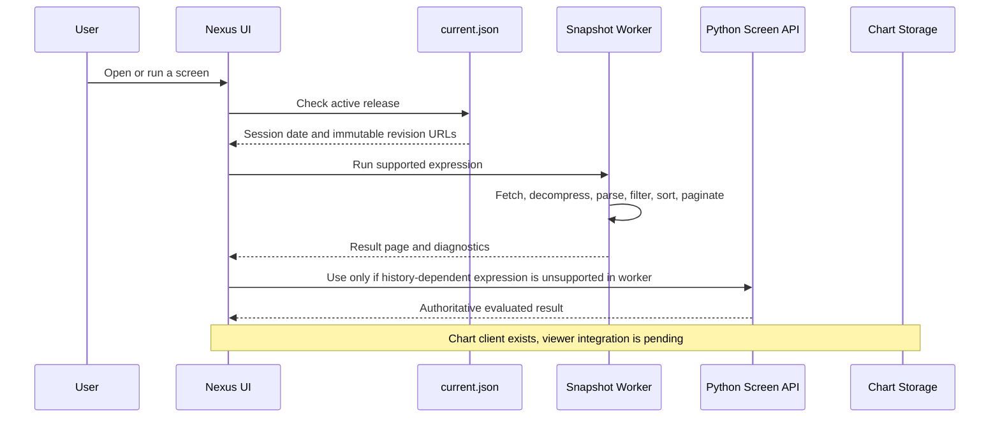
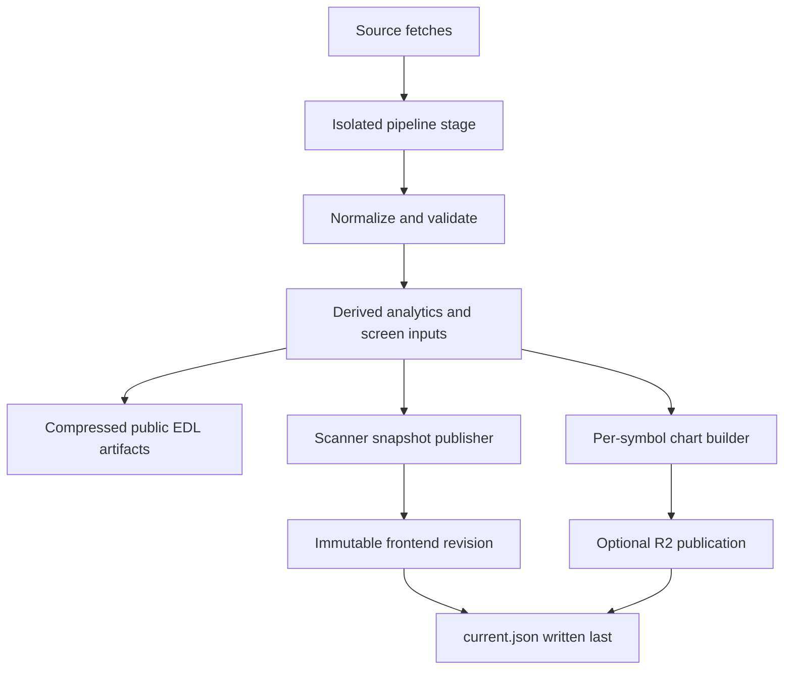

# Nexus Scanner

Nexus Scanner is an NSE equity research and screening system. It contains a React browser application, a Python market-data pipeline, immutable scanner releases, and optional Cloudflare R2 chart delivery.

Every result is tied to one published trading session and one immutable revision. The system does not silently combine a new stock snapshot with an old IPO catalogue, chart file, or filter result.

> Nexus Scanner is for research and data-engineering workflows. It is not investment advice. Upstream market data can be delayed, incomplete, corrected, rate-limited, or unavailable.

## Contents

- [What users can do](#what-users-can-do)
- [Technical architecture](#technical-architecture)
- [How people use this repository](#how-people-use-this-repository)
- [Every scanner form and filter family](#every-scanner-form-and-filter-family)
- [Calculation conventions and formulas](#calculation-conventions-and-formulas)
- [What happens at runtime](#what-happens-at-runtime)
- [How every published file is generated](#how-every-published-file-is-generated)
- [Storage, caching, and R2](#storage-caching-and-r2)
- [Local development](#local-development)
- [Configuration and production deployment](#configuration-and-production-deployment)
- [Recovery and troubleshooting](#recovery-and-troubleshooting)
- [Automated refreshes](#automated-refreshes)
- [Testing, data quality, and limits](#testing-data-quality-and-limits)

## Repository map

| Location | Responsibility |
| --- | --- |
| [`frontend/`](frontend/) | React 19 UI, TypeScript types, Vite server/build, browser screening worker, chart client, and frontend tests. |
| [`DO NOT DELETE EDL PIPELINE/`](DO%20NOT%20DELETE%20EDL%20PIPELINE/) | Python acquisition, history maintenance, calculations, condition engine, artifact validation, and publication. The directory name is preserved because existing workflows use it. |
| [`.github/workflows/daily_refresh.yml`](.github/workflows/daily_refresh.yml) | Weekday refresh, tests, scanner publication, R2 upload when configured, and generated-data commit. |
| [`.github/workflows/weekly_eod2_refresh.yml`](.github/workflows/weekly_eod2_refresh.yml) | Weekly adjusted-history overlay followed by the same validated publication flow. |
| [`docs/r2-chart-publication.md`](docs/r2-chart-publication.md) | R2 object layout, retry behavior, retention, and chart fields. |
| [`frontend/README.md`](frontend/README.md) | Frontend API details and local UI development. |

## Technical architecture

Nexus is deliberately split into a data plane and an interaction plane.

| Layer | Technology | Responsibility |
| --- | --- | --- |
| Browser UI | React 19, TypeScript, Vite, Tailwind, TanStack Query | Renders the screener, IPO catalogue, tables, and forms; restores workspace preferences. |
| Browser screen engine | Module Web Worker, TypeScript | Decompresses immutable snapshots, evaluates supported rules, sorts, and paginates without blocking the UI. |
| Condition contract | Typed TypeScript catalogue and Python registries | Keeps field names, inputs, presets, labels, and availability rules aligned across the UI and evaluator. |
| Python evaluator | Python, pandas, NumPy | Evaluates historical OHLCV, multi-session, delivery, pattern, earnings, and cross-series rules. |
| Data pipeline | Python, requests, BeautifulSoup, CSV/JSON/Gzip | Fetches, standardizes, validates, and promotes market artifacts. |
| Release store | Git-hosted immutable JSON and gzip files | Publishes compact scanner releases and a small active-release pointer. |
| Chart store | Cloudflare R2 | Supplies per-symbol compressed payloads through the chart client; an integrated chart viewer is not yet wired into the UI. |
| Automation | GitHub Actions | Runs daily and weekly refreshes, tests, publication, and generated-data commits. |

### Frontend modules

| Module | What it does |
| --- | --- |
| `frontend/src/App.tsx` | Owns top-level navigation and the active screener workspace. |
| `frontend/src/components/ExploreTab.tsx` | Mainboard screen controls, active filters, and result workflow. |
| `frontend/src/components/NewListingsTab.tsx` | IPO catalogue controls and table workflow. |
| `frontend/src/components/SymbolListTab.tsx` | Pasted symbol validation and custom-universe workflow. |
| `frontend/src/components/ScreenerModal.tsx` | Visual condition builder and preset editor. |
| `frontend/src/components/ConditionCatalogModal.tsx` | Searchable condition selection. |
| `frontend/src/components/ResultsTable.tsx` | Shared sortable and paginated equity table. |
| `frontend/src/api/realAdapter.ts` | Chooses snapshot-worker or Python API evaluation and validates release identity. |
| `frontend/src/api/snapshotEngine.ts` | Loads, validates, caches, filters, sorts, and pages a snapshot. |
| `frontend/src/api/snapshot.worker.ts` | Keeps snapshot computation off the UI thread. |
| `frontend/src/api/snapshotScreen.ts` | Compiles browser-supported conditions and caches result sets across pages. |
| `frontend/src/api/screenerApi.ts` | Typed facade selecting the real or mock adapter; methods do not all correspond to HTTP endpoints. |
| `frontend/src/data/` | Condition and preset catalogues compiled into the frontend build. |

### Pipeline modules

| Module area | What it does |
| --- | --- |
| `edl_pipeline.runner` | Orchestrates stages, script lanes, compression, validation, cleanup, and reports. |
| `edl_pipeline.publication` | Promotes only validated staged artifacts and triggers the frontend publisher. |
| `edl_pipeline.validators` | Checks schema, required fields, counts, and artifact readability. |
| `edl_pipeline.scanner.trend` | Normalizes OHLCV and evaluates the condition-expression tree with match/no-match/unavailable results. |
| `edl_pipeline.scanner.context` | Evaluates fundamentals, RS, earnings, surveillance, and snapshot-aligned conditions. |
| `edl_pipeline.scanner.patterns` | Implements gaps, inside bars, range contraction, VCP, resistance, and related chart patterns. |
| `edl_pipeline.scanner.presets` | Stores and validates the versioned 45-preset library. |
| `edl_pipeline.breadth` | Builds eligible universes, benchmark alignment, breadth measures, and ratings inputs. |
| `edl_pipeline.sources` | Encapsulates public Dhan, NSE archive, and news-source retrieval. |
| `edl_pipeline.transforms` | Produces fundamental, event, and market-breadth derived artifacts. |

## How people use this repository

### 1. Researcher: find an actionable candidate list

Use the running frontend at `localhost:8080` or a deployed build.

1. Select Mainboard or another available indexed universe such as Nifty 500.
2. Start from a preset such as Persistent Momentum, then tune its parameters; or build a rule from scratch.
3. Choose `Match all` when every rule must pass, or `Match any` for an OR screen.
4. Run the screen, sort the table, and copy symbols from the displayed result page.
5. Reopen the browser to restore the current workspace preferences.

This workflow is for idea generation and repeatable research. It does not execute trades or provide a portfolio recommendation.

### 2. Analyst: reproduce a screen for a published session

Use the revision/session visible in the screen result. The immutable release lets an analyst explain what data was used for the result and rerun the same expression against the matching backend inputs where history is available. Same-session data corrections create a new revision, preserving the older release rather than overwriting it.

### 3. Product team: embed or deploy the screener

Build the frontend as a static application:

```bash
cd frontend
npm install
npm run build
```

Host the resulting static files with immutable-cache rules for `data/revisions/*` and revalidation for `data/current.json`. Provide the Python `/screens/run` endpoint for expressions the browser worker cannot evaluate. Configure `VITE_API_BASE_URL` for the deployed API.

### 4. Data engineer: refresh public market artifacts

Run the EDL pipeline locally or let GitHub Actions run it on schedule. The pipeline stages files away from the current public release, validates them, then promotes the release only when the required checks pass.

```bash
cd "DO NOT DELETE EDL PIPELINE"
python3 run_full_pipeline.py
```

After the run, inspect `data_quality.json`, `pipeline_report.json`, and the generated browser release before publishing external changes.

### 5. Quant or developer: add a new condition or preset

1. Add a typed input definition to the frontend condition catalogue.
2. Add the condition's evaluation contract in the Python registry and implementation.
3. Define missing-data and session-alignment behavior explicitly.
4. Add unit tests for match, no-match, and unavailable outcomes.
5. If the rule belongs in a built-in scan, add or update its declarative preset definition.
6. Regenerate a snapshot and verify browser-worker support. Keep a Python fallback for rules that require unbundled historical data.

### 6. Data platform operator: run charts at scale

Set the R2 environment variables, enable `EDL_CHART_STORAGE=r2`, and run the normal pipeline. The publisher uploads immutable per-symbol files, verifies them, and updates the release only after all required publication work completes. An application consuming `screenerApi.getChart` can fetch a single chart at a time from the release URL template. The current table UI does not call this method.

## What users can do

### Mainboard screener

The mainboard workspace exposes a visual condition builder, built-in scans, and a compact query input. Query text is compiled by the Python scanner and never interpreted by a browser keyword heuristic.

1. Choose a built-in scan.
2. Add custom conditions through the visual filter builder.
3. Query text is compiled into the same expression tree by the Python query module. Unsupported clauses reject the whole request; repeated clauses and nested `AND`/`OR` groups are preserved.
4. Developers can use the symbol-list component and adapter to apply conditions to a custom symbol list.

Users choose a universe, combine conditions with `AND` or `OR`, run the screen, sort the common results table, paginate, and copy symbols. The evaluator supports nested expression trees. Universe definitions include Mainboard, Nifty 50, Nifty 500, MidSmall 400, and custom symbols; availability depends on the released membership data.

### IPO catalogue

The IPO view uses compact search, filters, sorting, page controls, and a listing window. Filters use the released IPO dataset and current snapshot fields. Its table displays symbol/company, listing date, current price, daily turnover, market cap, delivery percentage, sector, and industry. Issue price, listing price, and return since listing are not currently mapped into this table.

### Symbol screener

The symbol form accepts pasted tickers, normalizes them, reports invalid symbols, and produces a private custom universe for the same screen engine. It does not invent matches for unknown symbols.

### Saved preferences

The active tab, screener universe, conditions, match mode, and sort order are stored in browser `localStorage`. The IPO period, search, conditions, match mode, and sort order have separate keys under `nexus-scanner.*.v1`. This restores the current workspace; it is not a library of named saved screens. Clearing site storage removes these preferences. There is no account sync.

### Implemented features and integration boundaries

| Capability | Current implementation |
| --- | --- |
| Screening and IPO tables | Implemented in the two app tabs. |
| Copy TradingView symbols | Copies `NSE:<symbol>` values from the displayed page, not the entire matching universe. |
| Watchlist button | Displays a confirmation toast; no watchlist persistence or external integration exists. |
| Chart data | Generated payloads and a revision-validated `getChart` client exist; no integrated chart viewer exists. |
| Named saved screens | Not implemented; current workspace preferences persist automatically. |
| Explain API | The real adapter currently returns a placeholder valid response; it is not authoritative server validation. |
| Symbol-list component | Exists in source; top-level app navigation currently contains only screener and IPO. |

## Every scanner form and filter family

The filter catalog is a typed contract. A condition has a name, documented inputs, evaluation rules, and availability requirement. The client renders its form from this contract, and the Python evaluator uses the same condition identifiers.

### Trend and moving-average filters

| Condition | What it evaluates |
| --- | --- |
| Indicator Compare / Crossover | Numeric comparison or recent crossover between price transforms, indicators, or a fixed value, with independent periods and offsets. |
| MA Convergence | Spread among selected SMA/EMA values divided by close, with an explicit tolerance. |
| Price / Oscillator Divergence | Confirmed regular or hidden bullish/bearish divergence without future-bar leakage. |
| Supertrend Direction | Wilder-ATR Supertrend line and bullish/bearish state, or a recent direction turn. |
| Persistent Momentum | Price persistence above or below selected EMAs with the configured reset rule. |
| Price vs EMA / Price vs SMA | Latest close relative to the selected EMA or SMA. |
| EMA Shakeout & Reclaim | A recent dip through an EMA followed by a current reclaim. |
| MA Stack / Moving Average Stack Order | Ordered moving averages such as 20 above 50 above 200. |
| % Days Above MA | Share of a selected lookback spent above a selected moving average. |
| MA Slope / MA Slope & Trajectory | Direction and percentage movement of a moving average across its lookback. |
| EMA Key Level Reclaim | Recent EMA violation followed by a reclaim. |
| Consecutive Up Days | A run of positive-close sessions. |

### Price, volatility, range, and chart-pattern filters

| Condition | What it evaluates |
| --- | --- |
| Price Change % | Return across a trading-session window. A legacy `Below` request is interpreted as a decline of at least the threshold. |
| New High / New Low | Highest high or lowest low over a complete rolling lookback, optionally fired recently. |
| % From 52-Week High / Low | Latest close distance from the high or low over up to 252 sessions. |
| All-Time-High distance | Split- and bonus-adjusted distance from all available EOD history. |
| ATR % / ADR % | Wilder ATR or average daily high-low range as a percentage of price. |
| Consolidation Range | High-low range of a completed base. |
| Range Contraction / VCP | Relative contraction of recent and prior ranges or swing legs. |
| Inside Bar | Daily or weekly bars contained by preceding bars. |
| Unfilled Gap | Up or down gaps that have remained open or have filled. |
| Horizontal Resistance | Unbroken clustered swing-high resistance near the current base. |
| Gap Up / Gap Down | Session gaps relative to the prior close. |

### Volume, liquidity, delivery, and trading controls

| Condition | What it evaluates |
| --- | --- |
| RVOL / Volume vs Average | A session's volume relative to its preceding average-volume window. |
| Volume Trend | Recent volume compared with a prior base window. |
| Highest Volume in N Days | A high-volume event in its completed lookback. |
| Average Turnover | Average traded value in crore across a daily lookback. Intraday windows require intraday history. |
| Delivery % Spike | Delivery percentage against aligned delivery history. |
| Market Cap / Free-Float Market Cap | Current capitalisation and free-float-adjusted capitalisation. |
| Price Range / Circuit Band | Current close range and NSE price-band constraints. |
| F&O Ban / Series | Current official ban state and NSE listing series. |
| Exclude ASM / GSM | Latest available surveillance lists, including stage and fetch date. |

### Relative strength, breadth, and universe filters

| Condition | What it evaluates |
| --- | --- |
| Relative Strength | Stock return minus benchmark return over aligned sessions. |
| RS Line at New High | Relative-strength line at its lookback high while price remains below its own high. |
| RS Rating | Cross-sectional 1–99 percentile across the published eligible universe. |
| Index Membership | Published current index membership. |
| Market Breadth | Published breadth metrics for the supported universe and session. |
| Sector / Industry | Current published NSE classifications. |
| Listing Age | Trading sessions since listing. |

### Fundamental and earnings filters

| Condition | What it evaluates |
| --- | --- |
| P/E | Positive trailing P/E from the released fundamental snapshot. |
| Quarterly growth | QoQ or YoY revenue, net profit, PBT, EPS, or operating-margin growth. |
| Fundamental metric | ROE, ROCE, operating margin, verified debt/equity, PEG, five-year sales growth, latest-quarter revenue, non-current assets, total liabilities and annual interest coverage. Published price/history choices also include session VWAP, latest declared DPS, listing-covered ATH/ATL and five-year return. |
| EPS Last Year Higher | Latest annual EPS compared with the preceding annual EPS. |
| Days Since Earnings | Trading sessions since the latest reported earnings event. |

Financial amounts labelled in lakhs are converted from ScanX crore values. Statement periods and derived formulas are retained in metadata. D/E remains unavailable without actual borrowings; latest declared DPS is not annual DPS. See [published financial and price fields](docs/published-financial-and-price-fields.md) for source contracts, query examples and history coverage rules.

### Built-in scans

The versioned local preset library contains 45 scans, including Persistent Momentum, Easy Money, Relative Strength Leaders, RS Line at New High, Stage 2 Uptrend, Momentum Burst, Quiet Strength, 52-Week High Breakout, 20-Day High on Record Volume, Breakout from Tight Base, Pocket Pivot, ADX Trend Breakout, Circuit-Safe Breakout, VCP Contraction, Inside Bar Coil, Weekly Inside Bar, Volume Dry-Up Base, Flat Base, Horizontal Resistance, Flags & Pennants, Low-ATR Coil, 21 EMA Pullback, 50 EMA Shakeout, Higher-Low Pullback, Gap Support Retest, Volume Surge, Highest Volume in 3 Months, Delivery-Backed Accumulation, Sustained Accumulation, Unfilled Gap Up, Gap & Go, Gap Down Washout, 52-Week Low Bounce, RS Divergence Turn, Relative Weakness, Earnings Growth Momentum, Post-Earnings Drift, Growth at a Fair Price, Revenue & Profit Acceleration, Pre-Earnings Coil, Breadth-Gated Leaders, Liquid Trading Universe, Fresh IPO Base, Nifty 500 Momentum, and Midcap Breakout.

Preset defaults deliberately include market cap above ₹1,000 Cr, price above ₹10, and 50-day average turnover above ₹5 Cr. They have no upper market-cap or price ceiling and no blanket 2% or 5% circuit exclusion.

## Calculation conventions and formulas

All technical windows below use trading sessions, not calendar days. Data is cut off at the published session. A 20-session return requires 21 closes. Missing required history produces `unavailable`; a shortened window is not silently substituted unless that condition explicitly allows it.

| Calculation | Rule |
| --- | --- |
| SMA(N) | Mean of the latest N closes; a full N-session window is required. |
| EMA(N) | Recursive exponential average with `adjust=False`; required warmup still applies. |
| Return(N) | `100 × (latest close / close N sessions earlier − 1)`. |
| Daily return | Same formula with N=1. |
| Gap % | `100 × (current open / prior close − 1)`. |
| RVOL(N) | Current volume divided by the mean of the preceding N volumes, excluding the current session. |
| Average turnover(N) | Mean of `close × volume` over N sessions, divided by 10,000,000 for ₹Cr. |
| ADR(N) % | Mean of `100 × (high − low) / close` over N sessions. |
| True range | Maximum of `high − low`, `abs(high − prior close)`, and `abs(low − prior close)`. |
| ATR % | Wilder-smoothed true range divided by current close, multiplied by 100. |
| Consolidation range % | `100 × (window maximum high − window minimum low) / final close`. |
| RS over N sessions | Stock percentage return minus the aligned benchmark percentage return. |
| Quarterly growth % | `100 × (latest value − comparison value) / abs(comparison value)`; QoQ uses the prior quarter, YoY the same quarter a year earlier. Zero/missing base is unavailable. |
| Historical P/E | Selected report type's four consecutive announced quarters of net profit; market cap divided by positive total profit. Missing quarters or nonpositive profit are unavailable. |

The browser release precomputes selected SMA, return, RVOL, gap, and turnover values plus preset outcomes. The Python registry supports wider parameter choices. A different lookback, metric, or report type may need backend evaluation.

### Persistent Momentum and persistence defaults

Persistent Momentum combines the configured EMA persistence branches with OR: the default periods/durations are 10 EMA for 20 sessions, 20 EMA for 30 sessions, and 50 EMA for 50 sessions. Its preset then combines the selected turnover condition and shared eligibility restrictions with AND. Refer to the declarative preset for all actual defaults; editing a custom condition does not remove a preset's other restrictions.

The default EMA persistence mode is `extreme_reset`. A contrary close arms its low for an above run, or high for a below run. A later trade beyond that extreme resets the run; equality does not. The armed extreme can survive beyond the requested trailing window. This differs from requiring every close to stay above the EMA. SMA persistence uses `strict_close`; explicit alternate EMA modes remain supported by the engine.

### Daily and weekly inside bars

A daily inside bar has `high ≤ preceding high` and `low ≥ preceding low`. For a consecutive run, each bar is compared with the immediately preceding bar; N inside bars require N+1 bars.

Weekly bars group daily sessions by ISO year/week: first open, maximum high, minimum low, last close, summed volume, and last session date. The same containment comparison runs on those aggregates. The default `completed` mode excludes the current ISO week. The explicit `current` mode includes it and marks the result provisional because it can change before that week finishes. Weekly means aggregated daily input, not a separately fetched weekly candle feed.

### Signal timing, rankings, and unavailable inputs

- `fired_within=1` means the latest session; 2 also allows the preceding session.
- RS ratings use aligned stock/benchmark history and a cross-sectional eligible universe. The composite weights 21/63/126/252-session relative returns by 40/20/20/20; sufficient aligned history is required. A rating is not simply a stock's raw one-year return.
- Official delivery observations override overlapping fallback history. A current delivery percentage alone does not establish a historical spike.
- `match OR unavailable` is a match; `no_match OR unavailable` remains unavailable. `no_match AND unavailable` is no match; `match AND unavailable` remains unavailable.
- Historical classification, capitalisation, financial availability, and membership must satisfy their own date contracts. A future snapshot is not a valid substitute for an absent dated record.

Exact condition inputs, pattern definitions, and availability rules are documented in the [trend engine guide](DO%20NOT%20DELETE%20EDL%20PIPELINE/docs/TREND_CONDITION_ENGINE.md) and implemented under `src/edl_pipeline/scanner/`. These definitions establish local behavior; they do not guarantee identical results to another provider using different data or universe membership.

## What happens at runtime



### Browser release loading

1. The app loads `frontend/public/data/current.json` and validates its revision and session metadata.
2. It resolves the immutable `stocks.json.gz` URL when browser decompression is available, otherwise the JSON URL.
3. A persistent module worker fetches the snapshot with cache reuse, decompresses it, validates its revision/session/row count, and retains at most a small number of revisions.
4. The worker evaluates supported conditions against precomputed values, then returns only the requested result page rather than all matching rows.
5. Changing pagination reuses the matching and sorted set. Changing filters, universe, symbols, or sort recalculates the set.
6. An unsupported custom expression falls back to the Python `/screens/run` service, pinned to the same revision and session.

The main UI never claims a browser-only approximation is a result for a rule that needs the Python history engine.

### Browser charts

The chart client requests one immutable compressed payload using the chart URL template in the release. It verifies the symbol and session before returning it to the caller. A future chart viewer can consume this method without loading every stock's chart. It must provide its own loading, error, drawing, and event-marker UI.

### Precomputed work versus runtime work

| Operation | When it happens |
| --- | --- |
| Source retrieval, history overlays, fundamental normalization | Pipeline refresh. |
| RS ratings, breadth, events, and canonical market fields | Pipeline refresh. |
| Supported numeric snapshot metrics and 45 preset results | Snapshot publication, once per immutable release. |
| Chart candles and volume/event groups | Chart generation before cleanup. |
| Snapshot decompression, parsing, and validation | First use of a revision in the worker. |
| Supported custom comparisons, Boolean groups, universe selection | Browser screen execution against published metrics. |
| Historical/pattern expressions absent from the browser contract | Python fallback at request time. |
| Sorting and pagination | Worker; later pages reuse the cached matching set. |

Not every possible custom calculation is precomputed. Preset membership and selected metrics are; arbitrary historical conditions can still require the Python engine. The worker retains at most two loaded revisions and up to four compiled result sets per snapshot. The app checks the current release every 60 seconds and when focus returns. No WebAssembly runtime is required. If workers are unavailable, the same snapshot engine runs on the main thread.

### Runtime files

| File or path | Runtime use |
| --- | --- |
| `frontend/public/data/current.json` | Small active-release pointer. Revalidate frequently. |
| `frontend/public/data/revisions/<revision>/stocks.json.gz` | Compressed stock snapshot used by the worker. |
| `frontend/public/data/revisions/<revision>/stocks.json` | Compatibility snapshot for clients without compressed loading. |
| `frontend/public/data/revisions/<revision>/ipos.json` | Immutable IPO catalogue for that release. |
| `frontend/public/data/revisions/<revision>/release.json` | Revision metadata retained for an open historical release. |
| `daily/<session>/<chart-revision>/charts/<symbol>.json.gz` in R2 | One on-demand chart payload per symbol. |

## How every published file is generated



### 1. Source collection

The EDL pipeline collects public NSE archive data, Dhan ScanX/web data, official delivery files, corporate actions, filings, announcements, index data, F&O information, surveillance lists, and market data needed for the selected refresh. Source availability is not assumed: failed required stages stop publication.

### 2. History maintenance

The pipeline maintains local OHLCV, index OHLCV, delivery, scanner-history, and filing-history caches. Weekday refreshes add official recent data. The weekly workflow overlays available EOD2 adjusted history so longer lookbacks can be retained without downloading full history on every weekday run.

### 3. Normalization and calculations

The pipeline standardizes securities and calculates:

- Mainboard eligibility, listing metadata, market cap, classifications, and current tradability fields.
- OHLCV-derived moving averages, returns, RVOL, turnover, highs/lows, ATR/ADR, gaps, and pattern inputs.
- Relative-strength and breadth datasets with aligned benchmark sessions.
- Fundamental, earnings, shareholding, delivery, corporate-action, surveillance, F&O, and IPO artifacts.
- Data-quality and universe-reconciliation reports.

### 4. Artifact validation and promotion

The full refresh runs in an isolated temporary stage. It validates schema, required fields, counts, freshness, and cross-artifact dates before promotion. A failed stage or quality check leaves the previously published public files unchanged. Promotion rolls back files on ordinary exceptions, including frontend-publication errors; this is not a filesystem transaction across every file or protection against every process crash. Shared history caches may have been updated even when public promotion fails.

### 5. Browser snapshot publication

`frontend/publish_snapshot.py` reads validated EDL artifacts, calculates the browser-safe metrics and preset results, freezes local Python inputs for custom evaluations, and creates a content-hash revision.

It writes immutable revision files first, verifies the release, and writes `current.json` last. A same-session correction therefore gets a new immutable revision rather than overwriting an earlier result.

Each browser revision contains `stocks.json`, `stocks.json.gz`, `ipos.json`, and `release.json`. Condition and preset catalogues live in `frontend/src/data/` and ship with the application build. Frozen Python evaluation inputs live under `DO NOT DELETE EDL PIPELINE/.scanner_cache/revisions/<revision>/`; serving a frontend revision does not automatically make those private backend files available on another server.

### 6. Chart generation and R2 upload

The chart builder runs before temporary news and filings directories are removed. It creates one compressed JSON payload per symbol, validates the chart index, payload symbol, session, and content revision, then uploads immutable objects to R2 when configuration is complete.

### Chart payload and event retention

| Field/group | Content and window |
| --- | --- |
| Identity | Schema version, symbol, session (`asOfDate`), and first available candle (`historyStartDate`). |
| `candles` | Date, open, high, low, close, volume; all available cached sessions through the published session. |
| `volumeEvents.highestEver` / `lowestEver` | Highest/lowest daily volume across available history, not an independently guaranteed inception archive. |
| Monthly volume records | Highest-volume day in each of the latest 60 represented months. |
| Quarterly volume records | Highest- and lowest-volume day in each of the latest 20 represented quarters. |
| Yearly volume records | Highest-volume day in each of the latest 10 represented years. |
| `corporateActions` | Available actions whose ex-date is no later than the published session. |
| `earnings` | Available earnings records filed by the published session. |
| `regulatoryAnnouncements` | Available official announcements; no fixed item-count cap in the builder. |
| `marketNews` | Latest 50 available items. Optional source failure can leave this empty. |

The builder does not truncate candles to four years. A four-year chart means its input cache supplied roughly four years. Weekly execution alone is not proof that every symbol has inception history. Missing candles or event arrays must not be described as complete history. Zero-volume sessions remain valid inputs to low-volume records.

### Generated public artifacts

| Artifact | Contents |
| --- | --- |
| `all_stocks_fundamental_analysis.json.gz` | Canonical stock snapshot and published fundamental fields. |
| `sector_analytics.json.gz` | Sector and industry analytics. |
| `market_breadth.json.gz` / `market_breadth_v2.json.gz` | Current and historical breadth outputs. |
| `breadth_universe_snapshot.json.gz` | Fixed eligible universe used for breadth and RS calculations. |
| `all_indices_history_v2.json.gz` / `all_indices_list.json` | Published index metadata and history. |
| `corporate_action_ledger.json.gz`, `nse_corporate_actions.json.gz` | Corporate-action data used by published features and charts. |
| `nse_fno_ban.json.gz`, `rs_rating_daily.json.gz` | F&O ban and daily RS-rating artifacts. |
| `ipo_screener.json.gz` | IPO catalogue source. |
| `shareholding_history.json.gz`, `quarterly_financial_history.json.gz` | Published historical shareholding and financial records. |
| `data_quality.json`, `mainboard_universe_report.json`, `nse_universe_reconciliation.json` | Quality, universe, and reconciliation diagnostics. |
| `pipeline_report.json` | Release execution and final-validation report, generated on each successful pipeline run. |

## Storage, caching, and R2

| Data | Where it lives | Why |
| --- | --- | --- |
| Source code and compact public scanner releases | Git | Reviewable application and immutable browser release history. |
| Current browser pointer | Git/static host | Small release authority for the frontend. |
| Per-symbol chart payloads | Cloudflare R2 | On-demand delivery without growing Git history by every chart revision. |
| Raw OHLCV, delivery, and filing caches | Local workspace and GitHub Actions cache | Fast incremental pipeline runs. |
| Long-term raw-history backup | Private R2 backup, planned | Recovery when an Actions cache is evicted. |
| Current workspace preferences | Browser local storage | User-local state without a server account or named-screen library. |

GitHub Actions cache is an accelerator, not durable data storage. It may be evicted. Raw-history recovery should come from the planned private backup, not from an assumed cache hit.

### R2 behavior

R2 configuration is controlled by:

```text
EDL_CHART_STORAGE=r2
R2_ACCOUNT_ID
R2_ACCESS_KEY_ID
R2_SECRET_ACCESS_KEY
R2_PUBLIC_BASE_URL
R2_BUCKET=nexus-screener-chart-data
```

When one of the required R2 settings is absent, the scanner release still publishes without chart URLs and logs the missing settings. When all settings are present, an upload, verification, retention, or archive failure stops publication and preserves the previous active release.

R2 retention is:

- Daily chart revisions: 90 calendar days.
- Month-end chart revisions: retained indefinitely.
- The first successful release of a new month archives the prior month’s latest successful session.

The 90-day lifecycle age is based on object upload time and deletion is asynchronous. If publication remains down for more than 90 days, an active daily revision can expire before rollover archival. Month-end retention therefore requires successful publication and monitoring; it is not a guarantee during an indefinite outage. Private raw-history backup and automatic restoration are planned, not implemented by chart publication.

See [`docs/r2-chart-publication.md`](docs/r2-chart-publication.md) for the object layout and lifecycle details.

## Local development

### Prerequisites

- Python 3.9 or later.
- Node.js and npm compatible with `frontend/package-lock.json`.
- `rclone` only if directly testing an R2 upload.

### Pipeline setup

```bash
cd "DO NOT DELETE EDL PIPELINE"
python3 -m venv .venv
source .venv/bin/activate
pip install -r requirements.txt

python3 -m unittest discover -s tests -v
python3 -m compileall -q .
```

Run the complete pipeline when you intend to refresh local market files:

```bash
python3 run_full_pipeline.py
```

Diagnostic mode skips the OHLCV refresh and never promotes a new public release:

```bash
EDL_FETCH_OHLCV=0 python3 run_full_pipeline.py
```

### Publish local browser data

From the repository root, after a validated pipeline run:

```bash
python3 frontend/publish_snapshot.py
```

### Start the frontend

```bash
cd frontend
npm install
npm run dev -- --host localhost --port 8080 --strictPort
```

Open [http://localhost:8080](http://localhost:8080).

For local custom history conditions, Vite uses the Python bridge. A static production deployment must supply a backend for `POST /screens/run` or proxy `/api/screens/run` to that backend.

```env
VITE_USE_MOCK=false
VITE_API_BASE_URL=/api
```

`VITE_USE_MOCK=true` is only for UI development. It is not live market data.

## Configuration and production deployment

### Configuration reference

| Setting | Default / purpose |
| --- | --- |
| `EDL_BASE_DIR` | Override pipeline data root; otherwise the pipeline's configured local directory. |
| `EDL_FETCH_OHLCV` | True; false selects diagnostic behavior rather than normal public promotion. |
| `EDL_FETCH_OPTIONAL` | False; enables optional acquisition stages when selected. |
| `EDL_CLEANUP_INTERMEDIATE` | True; temporary fetch directories are removed after their consumers run. |
| `EDL_EOD2_DATA_DIR` | Existing EOD2 history checkout used for the adjusted-history overlay. |
| `EDL_CHART_STORAGE` | `local` by default; `r2` selects remote chart publication. Other values are rejected. |
| `R2_ACCOUNT_ID` | Required for configured R2 publication; account containing the bucket. |
| `R2_ACCESS_KEY_ID`, `R2_SECRET_ACCESS_KEY` | Required server-side S3-compatible credentials. Never place them in frontend variables or public artifacts. |
| `R2_PUBLIC_BASE_URL` | Required public chart origin; browser access and CORS must work from the frontend origin. |
| `R2_BUCKET` | `nexus-screener-chart-data` unless overridden. |
| `VITE_USE_MOCK` | False unless exactly `true`; selects fabricated UI-development data when enabled. |
| `VITE_API_BASE_URL` | `/api` when absent; adapter appends `/screens/run`. Build-time frontend setting. |

Pipeline Boolean settings accept familiar true/false forms (`1/0`, `yes/no`, `on/off`); invalid values warn and use the default. Consult the workflow and source for additional source-specific settings rather than assuming this table enumerates every fetcher's tuning option.

### What a production installation needs

1. **Static application:** serve `frontend/dist` from a host supporting the app's assets and public data files. Deploy the application/catalogue version compatible with the published snapshot.
2. **Release authority:** deploy immutable revision directories before updating `data/current.json`. Revalidate the pointer; cache immutable revision URLs for reuse. Keep the JSON fallback available alongside gzip.
3. **Historical screen service:** provide `POST <VITE_API_BASE_URL>/screens/run` for unsupported worker expressions. The response must use the requested immutable revision. Preserve the corresponding frozen evaluation inputs and history on the server.
4. **Chart origin:** when charts are enabled, expose the R2 URL template with suitable browser CORS and gzip delivery. A scanner-only release legitimately has no chart URLs.
5. **Operator monitoring:** watch failed workflows, stale session pointers, missing history, archive failures, and object expiry. Scheduled time is not a completion guarantee.

Vite's local middleware handles `POST /api/screens/run` by managing a persistent Python worker. `npm run build` produces static files and does **not** package that middleware as a production Python service. A production process manager, reverse proxy, request limits, and server deployment must be supplied separately. Static hosting alone supports worker-evaluable scans, not every historical custom condition.

The adapter's catalogue comes from compiled frontend data; IPO rows come from the immutable static release. The explain method is currently a placeholder. Do not create an assumed server route for every method in `screenerApi`.

### Release identity and retry boundaries

Scanner revisions are content-addressed from their inputs and generated content. Chart revisions validate compressed symbol payloads and their content digest. R2 uploads use immutable revision paths and publish the scanner pointer only after required upload/verification succeeds. An existing immutable object must agree with the intended release; it must not be overwritten with different data.

Missing R2 configuration skips charts and permits fresh scanner publication. Once configuration is complete, upload failures stop publication. Recover and rerun the normal publisher; do not patch `current.json` to point at a partly uploaded chart set.

## Recovery and troubleshooting

### Refresh fails before publication

Inspect the workflow's failed stage and local `pipeline_failure_report.json` or `data_quality_failure.json` where generated. Fix the failed source, schema, freshness, or quality gate, then rerun the normal pipeline. Public promotion is gated; do not bypass validation just to advance the session date. Retain the prior valid release until recovery succeeds.

### History is missing or shorter than expected

First inspect a symbol's actual earliest/latest cache dates and its chart `historyStartDate`. A successful Actions cache restore or weekly run does not prove complete inception coverage. Check symbol identity/ISIN mappings before merging another cache.

To synchronize a bounded date range from an existing compatible EDL history directory, run from the pipeline directory:

```bash
python3 sync_local_scanner_history.py \
  --source-root /path/to/existing/EDL \
  --from-date 2026-09-29 \
  --as-of-date 2026-10-01
```

The dates above are examples; choose the missing range. The source directory needs its identity map and history files. The synchronizer validates identities and merges history with official overlays. Without `--source-root`, it can fetch the requested missing daily data. A bounded daily recovery is not an inception backfill.

After successful history recovery, regenerate the charts and scanner release from matching artifacts:

```bash
# From the pipeline directory, after data/session validation
python3 build_chart_artifacts.py
cd ..
python3 frontend/publish_snapshot.py
```

The complete pipeline normally handles this ordering. Do not regenerate a newer pointer from mismatched financial, OHLCV, delivery, and chart sessions. Private R2 raw-history backups and automatic restore are still planned; the existing R2 chart files are derived outputs, not a replacement for all source caches.

### Browser requests fail or results are unavailable

| Symptom | Check |
| --- | --- |
| Snapshot cannot load | Pointer and immutable URLs exist; JSON/gzip content, revision, session, and row count agree. |
| Presets work but custom history rules fail | Python fallback is running and has the requested frozen revision/history. |
| Insufficient history | Required full lookback and warmup exist for that symbol. Newly listed securities may legitimately lack them. |
| History not aligned | Latest cached trading session agrees with the released screen date. |
| Chart unavailable | Release includes chart URLs; object exists; browser CORS/decompression works; symbol/session validation passes. |
| Missing earnings/news markers | Source data was acquired before cleanup and the records satisfy the release cutoff. Empty optional event arrays can be valid. |
| Old preferences reappear | Current workspace state is restored from this browser origin's local storage. |

For a rollback, redeploy a known valid immutable release and its compatible application/backend inputs through the normal deployment process. Ensure retained R2 objects still exist before restoring a pointer. Reverting a Git commit alone does not recreate expired R2 objects or evicted private history.

## Automated refreshes

### Daily weekday workflow

At 16:00 IST, Monday through Friday, the daily workflow restores available caches, runs the Python and scanner-publication tests, refreshes market inputs, calculates artifacts, publishes the browser snapshot, optionally uploads charts, and commits validated generated files.

### Weekly adjusted-history workflow

At 09:00 IST each Sunday, the weekly workflow restores its history caches, updates the EOD2 adjusted-history checkout, overlays the long-history inputs, runs the same validation and publication sequence, and commits the result.

Both workflows use the same concurrency group. A daily release cannot race a weekly release.

## Testing, data quality, and limits

### Commands

```bash
# EDL pipeline tests
cd "DO NOT DELETE EDL PIPELINE"
python3 -m unittest discover -s tests -v

# Browser snapshot and R2 publication tests
cd ..
python3 -m unittest discover -s frontend -p 'test_*.py' -v

# Frontend tests and production build
cd frontend
npm test
npm run build
```

### Match states

| State | Meaning |
| --- | --- |
| Match | All required inputs were available and the rule passed. |
| No match | All required inputs were available and the rule failed. |
| Unavailable | A required input was missing, insufficient, stale, or misaligned to the screen session. |

Unavailable is a deliberate result. It is used for missing OHLCV history, insufficient moving-average warmup, delivery gaps, unavailable historical snapshots, absent index membership, stale financial data, and unsupported intraday history. It never becomes a positive match.

### Important limits

- Historical technical screening needs local OHLCV history aligned to the requested session.
- Intraday turnover modes remain unavailable until intraday history is collected.
- Historical values for current-only fields, such as classification or P/E, cannot be reconstructed from a future snapshot.
- Data sources can change format or fail; a successful code test does not prove a particular upstream source returned complete live data.
- R2 charts are absent from scanner-only releases when R2 is not configured.

Read [`DO NOT DELETE EDL PIPELINE/docs/DATA_LIMITATIONS.md`](DO%20NOT%20DELETE%20EDL%20PIPELINE/docs/DATA_LIMITATIONS.md) and [`DO NOT DELETE EDL PIPELINE/docs/PIPELINE_INTEGRITY.md`](DO%20NOT%20DELETE%20EDL%20PIPELINE/docs/PIPELINE_INTEGRITY.md) before operating a live refresh.

## Further reading

- [Pipeline guide](DO%20NOT%20DELETE%20EDL%20PIPELINE/README.md)
- [Trend condition engine](DO%20NOT%20DELETE%20EDL%20PIPELINE/docs/TREND_CONDITION_ENGINE.md)
- [Market breadth methodology](DO%20NOT%20DELETE%20EDL%20PIPELINE/docs/BREADTH_METHODOLOGY.md)
- [NSE delivery data](DO%20NOT%20DELETE%20EDL%20PIPELINE/docs/NSE_DELIVERY_DATA.md)
- [R2 chart publication](docs/r2-chart-publication.md)
- [Frontend guide](frontend/README.md)
- [Contribution guide](CONTRIBUTING.md)

## License

[MIT](LICENSE)
